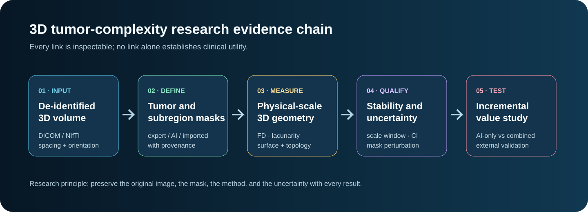
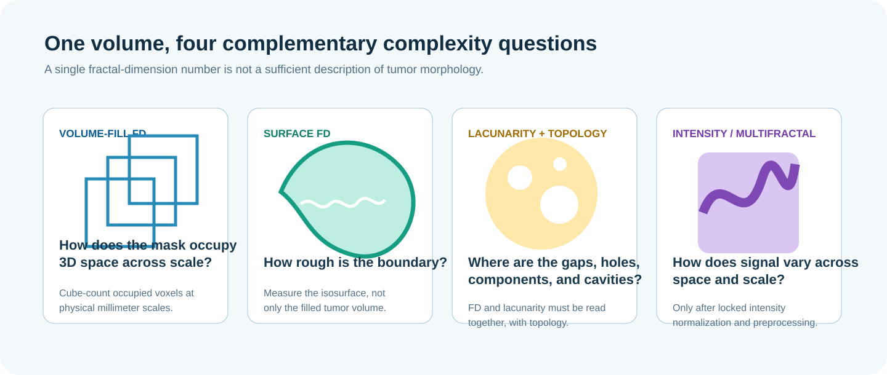

# 3D volumetric fractal analysis and tumor complexity

## A rigorous product and research blueprint for Fractals Web

> Status: design and research roadmap. This document describes methods worth implementing and testing. It does **not** establish diagnostic accuracy, prognostic value, treatment utility, or clinical readiness for any method described here.



## Executive thesis

Fractals Web can evolve from a 2D exploratory workbench into a transparent platform for **volumetric complexity research**. The central scientific question is deliberately narrow and testable:

> For a prespecified imaging task, can standardized 3D geometric and multi-scale morphology features add reproducible information beyond an AI-only localization or segmentation baseline?

This is more rigorous than asking whether fractal dimension can “detect cancer.” AI and fractal analysis perform different jobs. An AI system can propose a region, segment a subregion, or estimate a task-specific probability. A 3D fractal workflow can quantify aspects of the resulting geometry: how a segmented volume fills physical space across scale, how irregular its surface is, how gaps are distributed, and how stable those measurements remain under reasonable changes in segmentation and preprocessing. The combined workflow must be tested against an AI-only comparator; it cannot be assumed to be better.

Volumetric imaging is the natural setting for this question. MRI, CT, PET, and many parametric imaging maps represent anatomy as voxels in three-dimensional physical space. A single axial slice can be unrepresentative of a heterogeneous lesion; whole-volume analysis retains spatial structure that slice-only approaches discard. Reviews of tumor heterogeneity describe exactly this opportunity while emphasizing the substantial translation and validation hurdles [1, 2].

## Why 3D changes the scientific problem

### A tumor is not a stack of unrelated 2D images

A scan has a coordinate system, voxel spacing, orientation, acquisition protocol, and often multiple modalities. The same lesion may look simple in one slice and complex in another. Whole-volume analysis allows a study to preserve:

- total lesion and subregion extent;
- connectedness, cavities, and fragmentation;
- boundary geometry in all orientations;
- spatial relation between enhancing tissue, non-enhancing tissue, necrosis, edema, or functional signal;
- longitudinal change at matched physical scales.

The DICOM Segmentation object is specifically designed to retain the segmentation's spatial relationship to its referenced volume; DICOM also supports binary and fractional segmentations [3]. NIfTI is an equally practical research interchange format when its affine transform and voxel dimensions are preserved.

### Do not confuse a 3D summary with a true 3D fractal measurement

Some published workflows calculate 2D metrics in axial, coronal, and sagittal planes and average them into a “3D” summary. Such a summary can be useful for replication or comparison, but it is not the same as applying cube counting to a three-dimensional voxel object. Fractals Web should make the distinction explicit:

- **Planar summary FD**: an aggregate of slice or plane measurements.
- **Volumetric cube-counting FD**: the scaling behavior of occupied three-dimensional cubes.
- **Surface FD**: the scaling behavior of a reconstructed 3D boundary/isosurface.

This terminology protects the project from overstating what was measured. Published glioma work demonstrates that 3D FD and lacunarity of tumor subcomponents are an active area of investigation; it does not eliminate the need for independent validation [4].

### Fractal dimension is necessary but not sufficient

FD describes scale-dependent complexity, not disease identity, biology, or outcome. Two structures can share an FD while differing in internal voids, topology, or texture. Therefore, an honest 3D feature panel should always pair FD with complementary measurements and display them as **descriptive geometry**, not a clinical verdict.



## The metric family to implement

### 1. Volumetric occupancy: 3D cube-counting dimension

For a binary tumor mask \(M\), overlay cubes of physical side length \(\epsilon\) across a locked set of scales. Let \(N(\epsilon)\) be the number of cubes intersecting or occupied by the mask, with the occupancy definition stated in the provenance record. Estimate the slope over a validated scaling window:

\[
D_{\mathrm{volume}} = \lim_{\epsilon \to 0}\frac{\log N(\epsilon)}{\log(1/\epsilon)}.
\]

For an ordinary filled object, the estimate is bounded conceptually by 0 to 3. In practice, finite resolution, segmentation quality, and the available scale range determine whether a reported slope is meaningful. The interface must show the log-log plot, selected window, number of valid scales, fit statistic, and confidence interval—not only the final number.

**Implementation choices to lock before analysis**

- Use cube side lengths in millimeters after a documented spatial harmonization step.
- Define whether a cube is occupied by any mask voxel, a minimum fraction of voxels, or a fractional mask threshold.
- Translate the grid origin over a prespecified set of offsets and report the spread; cube-counting estimates can be grid-position sensitive.
- Use a prespecified robust regression or ordinary least squares procedure, never a manually selected favorable line.
- Reject or qualify an estimate with too few independent physical scales, a narrow scaling range, weak fit, or high grid-origin sensitivity.

### 2. Surface fractal dimension

Volume-fill FD and surface FD answer different questions. Surface FD should be calculated on a binary boundary or isosurface derived from the mask. It can characterize boundary irregularity while controlling for total volume, subject to the same scale and stability safeguards.

Record the surface-extraction method, mask threshold, interpolation rule, smoothing rule, mesh resolution, and any hole-filling operation. A visually appealing smoothed mesh can erase precisely the geometric detail under study; the unmodified measurement mask must remain inspectable.

### 3. Lacunarity, topology, and Minkowski functionals

Lacunarity characterizes the distribution of gaps; it gives context to FD rather than serving as a generic “heterogeneity score.” Add a topology panel with:

- number of connected components;
- Euler characteristic;
- cavity/void count and volume;
- surface-to-volume ratio;
- compactness, sphericity, and principal-axis lengths.

Minkowski functionals measured over intensity thresholds are a valuable non-fractal companion because they summarize volume, surface area, mean breadth, and Euler characteristic. They should be presented as a threshold-response curve, not reduced prematurely to a single score.

### 4. Multi-scale internal signal and multifractal analysis

Binary masks capture geometry, while intensity analysis examines internal signal. This is scientifically interesting but substantially more fragile because MRI intensity is not intrinsically standardized and CT/PET have modality-specific concerns. Implement it only after locked normalization, discretization, resampling, bias-field, and filtering choices.

Candidate research features include:

- 3D intensity-threshold occupancy curves;
- local 3D fractal maps calculated in a fixed physical neighborhood;
- multifractal spectrum summaries;
- lacunarity of thresholded enhancement or functional-parametric maps;
- distance-to-boundary complexity profiles from core to infiltrative margin.

No internal-signal feature should be compared across institutions until its repeatability has been established. Radiomic features are known to vary with acquisition, reconstruction, preprocessing, segmentation, and software implementation [5, 6].

### 5. Subregion and shell analysis

For a brain-tumor example, analyze anatomically or radiologically defined subregions separately rather than treating “the tumor” as one homogeneous object:

- enhancing tumor;
- non-enhancing tumor and/or necrotic core;
- peritumoral edema;
- whole tumor;
- concentric margin shells at fixed physical distances.

The resulting question becomes interpretable: “Is the boundary complexity of the enhancing region stable and different from its own non-enhancing component?” It is not “Is this patient high risk?” A recent glioma study used enhancing, non-enhancing/necrotic, and edema subcomponents, illustrating the scientific feasibility of this decomposition [4].

### 6. Longitudinal and 4D research modes

The most original future direction is not merely a 3D snapshot but a **complexity trajectory**:

- matched baseline and follow-up volumes;
- same segmentation protocol and physical-scale grid;
- registration quality recorded and shown;
- change in volume, surface FD, volume FD, lacunarity, and subregion proportions;
- within-subject uncertainty from repeat processing and mask perturbations.

For dynamic contrast-enhanced MRI or other parametric imaging, a future research module can construct spatial-parametric hypervolumes. Earlier work proposed treating a kinetic parameter as an additional dimension and calculating geometric/fractal descriptors; this is conceptually promising but requires especially careful validation [7].

## The proposed Fractals Web product: 3D Volumetric Complexity Lab

### User experience principles

The interface should be visually rich without forcing a user to interpret every metric. Use progressive disclosure:

1. **Orient** — see the volume, voxel spacing, orientation, and upload/privacy state.
2. **Define** — import or select a segmentation and explicitly name the analyzed subregion.
3. **Measure** — run the standard physical-scale protocol.
4. **Qualify** — show fit, sensitivity, and reasons a result may be withheld.
5. **Compare** — optionally compare AI localization, expert/imported mask, and morphology without merging their meanings.
6. **Export** — preserve methods and provenance for reproducibility.

The primary screen should contain one central tri-planar viewer plus a lightweight 3D rendering. A single evidence rail can show: `mask quality → 3D geometry → stability → comparison status`. Detailed charts, tables, and advanced controls belong behind expandable sections.

### The essential views

| View | User need | Required evidence |
| --- | --- | --- |
| Tri-planar viewer | Locate the lesion in axial, coronal, sagittal planes | crosshairs, physical coordinates, source modality |
| 3D rendering | Understand the whole volume and subregion relationship | opacity controls, clipping plane, no cosmetic smoothing by default |
| Scale plot | Inspect the basis of FD | all candidate scales, selected window, slope, CI, fit |
| Stability panel | Decide whether a measurement is reportable | grid offsets, segmentation perturbation, resampling sensitivity |
| AI/morphology panel | Keep localization and geometry separate | original, mask source, overlap, no diagnostic conclusion |
| Provenance export | Allow audit and reuse | hashes, parameters, software version, warnings, timestamps |

### File formats and local-first processing

First-class inputs should be:

- NIfTI-1/2 (`.nii`, `.nii.gz`) volume plus segmentation mask;
- DICOM image series with DICOM SEG where supported;
- research-only derived maps with explicit units and acquisition provenance.

Default behavior should remain browser-local. Do not transmit a volume, DICOM header, segmentation, derived metric, or screenshot to analytics. For volumes too large for a browser, offer an explicit opt-in research compute connector later; do not silently upload data.

## Architecture path for this workspace

### Phase 0 — scientific and product specification

Before code, create a versioned `3d-analysis-spec.json` that locks:

- accepted formats and de-identification requirements;
- physical resampling policy;
- mask interpolation policy (normally nearest-neighbor for categorical masks);
- cube scales, grid offsets, occupancy rule, and regression method;
- quality thresholds and result-withholding rules;
- metrics, units, names, and export schema;
- explicit non-diagnostic language.

This is the most important artifact. A polished 3D viewer without a locked measurement specification is not a reproducible scientific instrument.

### Phase 1 — synthetic phantom and unit-test foundation

Create deterministic fixtures before accepting patient-derived volumes:

- filled cube and sphere: expected ordinary 3D behavior;
- Menger sponge or other mathematically defined 3D fractal: known theoretical/approximate scale behavior;
- translated and rotated masks: grid-origin and orientation sensitivity tests;
- anisotropic synthetic voxels: resampling tests;
- one-voxel dilation/erosion: segmentation-sensitivity tests;
- invalid sparse volume: result-withholding test.

Add a pure TypeScript `volumetric-box-count.ts` module, independently testable from the UI. It should return both values and diagnostics, for example:

```ts
type VolumetricComplexityResult = {
  status: 'ready' | 'unreliable' | 'withheld'
  volumeFillFd?: number
  surfaceFd?: number
  lacunarity?: number
  fit: { r2: number; scaleCount: number; scalingRangeMm: [number, number] }
  sensitivity: { gridOffsetSpread: number; maskPerturbationSpread: number }
  warnings: string[]
  provenance: VolumetricAnalysisProvenance
}
```

### Phase 2 — volume data model and import boundary

Create a module boundary such as:

```text
src/modules/volumetric/
  contracts.ts
  niftiImport.ts
  dicomSegImport.ts
  spatialGeometry.ts
  volumetricBoxCount.ts
  surfaceMetrics.ts
  uncertainty.ts
  workers/
  VolumetricComplexityPage.tsx
```

The `contracts.ts` type must preserve dimensions, spacing, orientation/affine, modality, units, source hash, segmentation label, and de-identification status. Do not allow a raw `Float32Array` to move through the application without spatial metadata.

### Phase 3 — browser performance and visualization

Use a dedicated Worker for parsing, resampling, cube counting, perturbation analysis, and surface extraction. Transfer typed-array buffers rather than copying them. Build a multi-resolution pyramid so a fast overview loads before full-resolution measurement. Render only the slices and 3D bricks needed for the current view.

Suggested performance rules:

- lazy-load the 3D module and parser only on the 3D route;
- use a memory budget with a visible, non-alarming fallback message;
- cancel a prior analysis when a source, mask, or protocol changes;
- use WebGL as baseline and WebGPU only as an optional acceleration path;
- never let rendering resolution silently change the measurement resolution;
- preserve a no-3D-render fallback that still permits accessible chart and slice inspection.

### Phase 4 — transparent AI complementarity

The first product version should accept an imported segmentation as the measurement target. AI-generated segmentation can be added later but must be clearly labeled as a proposed mask and compared against a reference when available.

Build three research-only analysis arms:

1. AI/localization baseline.
2. Locked 3D morphology feature panel.
3. Prespecified combined model.

The interface should never imply the combined arm is superior before a study demonstrates it. The valid outcome could be “no incremental value,” which is scientifically useful.

### Phase 5 — study execution and publication package

Freeze the code version and protocol before outcome analysis. Use a development cohort only for protocol selection and model tuning; reserve a site-held-out external cohort for the final evaluation. Report:

- segmentation agreement and handling of failed cases;
- FD and lacunarity repeatability/ICC under perturbation and test-retest where available;
- calibration, discrimination, confidence intervals, and subgroup performance;
- AI-only, morphology-only, and combined performance;
- missing data, excluded scans, and negative results;
- a public methods appendix, code revision, environment, and derived-data manifest where permitted.

Use the CLAIM 2024 checklist for the AI component and IBSI reference resources wherever the workflow overlaps standardized radiomic computation [8, 9].

## Study design: how to prove or disprove incremental value

### Prespecify the task

Choose one disease, one modality family, one endpoint, one segmentation definition, and one intended-use statement. A defensible initial task could be exploratory stratification of adult diffuse glioma research cohorts using preoperative multiparametric MRI—not a diagnostic or treatment recommendation.

### Lock preprocessing before the final test set

Record every choice:

- orientation and registration;
- target voxel spacing and interpolation;
- MRI intensity normalization or CT/PET calibration;
- mask source and postprocessing;
- physical scales and feature definitions;
- feature selection procedure;
- classifier family, calibration method, and missing-data treatment.

### Separate development from external validation

Split by patient and, whenever possible, by institution/site. Never allow multiple timepoints, modalities, or slices from one patient to cross between development and test partitions. The public BraTS resources are useful starting points because they provide multiparametric MRI and tumor subregion labels, but their intended challenge partitions and access conditions must be honored [10]. Pediatric and adult cohorts should be analyzed separately; BraTS-PEDs is a distinct pediatric resource with its own population and protocol variation [11].

### Evaluate more than a headline AUC

At minimum report discrimination, calibration, confidence intervals, prevalence, decision-relevant threshold behavior, subgroup results, failures, and the incremental benefit of the combined model relative to the AI-only baseline. A high retrospective score on a small feature-rich cohort is not evidence of clinical utility. Systematic reviews warn that high feature-to-sample ratios and incomplete validation are recurring sources of overfitting [2].

## Quality gates that should withhold a result

A genuine research workbench earns trust by declining to create a deceptively precise number. Withhold or label an estimate unreliable when:

- no valid mask or spatial affine is available;
- voxel spacing is strongly anisotropic and no documented harmonization occurred;
- too few independent scales exist;
- the selected scale window is too narrow;
- fit quality is below the locked threshold;
- grid-origin sensitivity exceeds the locked tolerance;
- a one-voxel perturbation changes the feature beyond the locked tolerance;
- a modality-specific intensity prerequisite is absent;
- source orientation, unit, or registration is inconsistent;
- the result is outside the validated scope of the protocol.

These are not error messages. They are scientific findings about measurement reliability.

## Data governance, privacy, and ethics

- Do not commit patient images, DICOM headers, free-text radiology reports, or protected health information to this repository.
- Make de-identification status explicit; “DICOM file” does not imply de-identified.
- Default to local processing and do not send volumes or derived clinical information to PostHog, Clarity, or any analytics provider.
- Keep research identifiers separate from clinical identifiers.
- Document data-use agreements, licenses, cohort provenance, and consent restrictions before creating derived artifacts.
- Require domain-expert and institutional review before making any claim that might affect patient care.

## A credible first demonstration

The first paper or grant milestone should not promise diagnosis. It should demonstrate that the implementation is technically trustworthy:

1. Reproduce expected results on mathematical 3D phantoms.
2. Demonstrate deterministic output and complete provenance.
3. Quantify sensitivity to grid offset, voxel spacing, mask perturbation, and software version.
4. Compare planar summary, volumetric FD, surface FD, lacunarity, and conventional shape metrics.
5. Test a locked feature panel on a development cohort.
6. Evaluate the final frozen pipeline on an independent cohort.
7. Report whether complexity adds value beyond the AI baseline—or does not.

That result would be valuable whether positive or negative. The innovation is not claiming that a fractal number knows a diagnosis; it is making a biologically motivated, interpretable 3D geometry hypothesis auditable and falsifiable.

## Reference set

1. O'Connor JPB, et al. *Imaging Intratumor Heterogeneity: Role in Therapy Response, Resistance, and Clinical Outcome.* Clin Cancer Res. 2015. [Open article](https://pmc.ncbi.nlm.nih.gov/articles/PMC4688961/)
2. Hatt M, et al. *Quantification of Heterogeneity as a Biomarker in Tumor Imaging: A Systematic Review.* PLOS One. 2014. [Open article](https://pmc.ncbi.nlm.nih.gov/articles/PMC4203782/)
3. DICOM Standards Committee. *Segmentation Storage SOP Class and volumetric segmentation guidance.* [DICOM segmentation standard](https://www.dicomstandard.org/News/ftsup/docs/sups/sup111.pdf), [volumetric guidance](https://www.dicomstandard.org/news-dir/current/docs/sups/sup240-slides.pdf)
4. Yadav N, Mohanty A, V A, Tiwari V. *Fractal dimension and lacunarity measures of glioma subcomponents are discriminative of the grade of gliomas and IDH status.* NMR Biomed. 2024. doi:10.1002/nbm.5272. [PubMed](https://pubmed.ncbi.nlm.nih.gov/39367752/)
5. Traverso A, et al. *Repeatability and Reproducibility of Radiomic Features: A Systematic Review.* Int J Radiat Oncol Biol Phys. 2018. [PubMed](https://pubmed.ncbi.nlm.nih.gov/30170872/)
6. Jena R, et al. *Investigation of the Inter- and Intrascanner Reproducibility and Repeatability of Radiomics Features in T1-Weighted Brain MRI.* J Magn Reson Imaging. 2022. [PubMed](https://pubmed.ncbi.nlm.nih.gov/35396777/)
7. Aerts HJWL and related DCE-MRI heterogeneity literature summarized in: *Quantifying Tumor Vascular Heterogeneity with Dynamic Contrast-Enhanced MRI: A Review.* [Open article](https://pmc.ncbi.nlm.nih.gov/articles/PMC3085501/)
8. Tejani AS, et al. *Checklist for Artificial Intelligence in Medical Imaging (CLAIM): 2024 Update.* Radiol Artif Intell. 2024. doi:10.1148/ryai.240300. [PubMed](https://pubmed.ncbi.nlm.nih.gov/38809149/)
9. Zwanenburg A, et al. *The Image Biomarker Standardization Initiative: Standardized Quantitative Radiomics for High-Throughput Image-based Phenotyping.* Radiology. 2020. [PubMed](https://pubmed.ncbi.nlm.nih.gov/32154773/); [IBSI reference resources](https://theibsi.github.io/ibsi1/)
10. RSNA-ASNR-MICCAI BraTS 2021 analysis resource, The Cancer Imaging Archive. [Collection details](https://www.cancerimagingarchive.net/analysis-result/rsna-asnr-miccai-brats-2021/)
11. BraTS-PEDs, The Cancer Imaging Archive. [Collection details](https://www.cancerimagingarchive.net/collection/brats-peds/)
12. Kim S, et al. *Comparison of Diagnostic Performance of Two-Dimensional and Three-Dimensional Fractal Dimension and Lacunarity Analyses for Predicting the Meningioma Grade.* Brain Tumor Res Treat. 2020. [PubMed](https://pubmed.ncbi.nlm.nih.gov/32390352/)
13. Goh V, et al. *Lung cancer—a fractal viewpoint.* Nat Rev Clin Oncol. 2016. [Open article](https://pmc.ncbi.nlm.nih.gov/articles/PMC4989864/)

## Appendix: language approved for the product

Use: “3D geometric complexity estimate,” “research measurement,” “AI-proposed region,” “result withheld because stability criteria were not met,” and “hypothesis for validation.”

Avoid: “diagnoses tumor,” “proves aggressiveness,” “predicts outcome,” “clinical grade,” “risk score,” or “revolutionary biomarker” unless a specific, independently validated study supports the statement and the intended-use context is made explicit.
